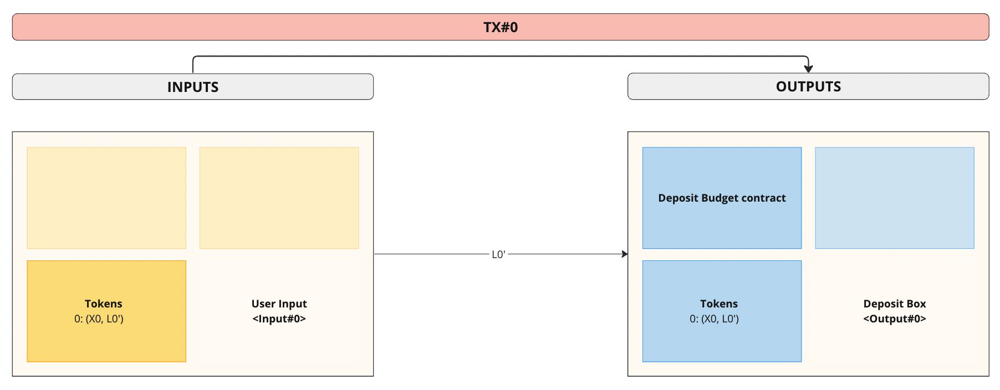
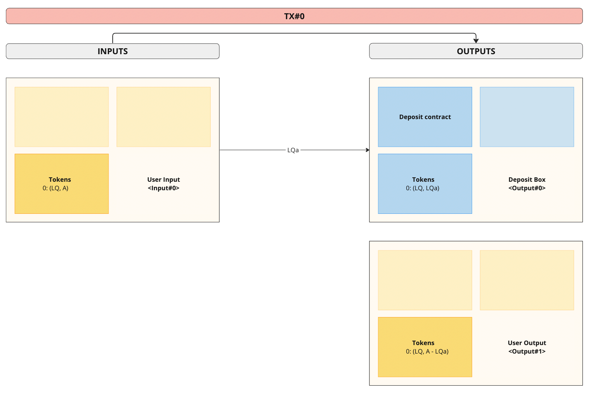
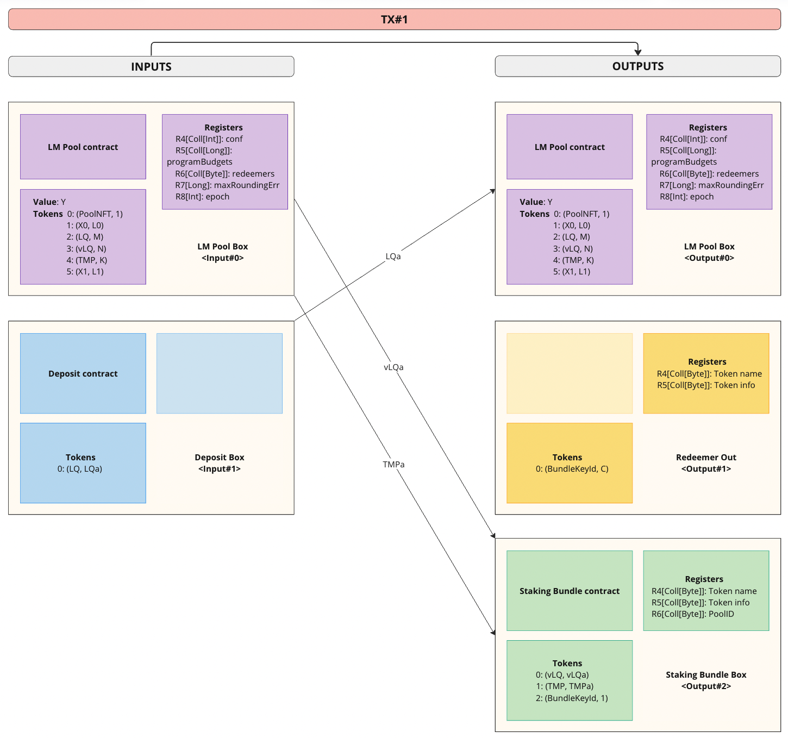
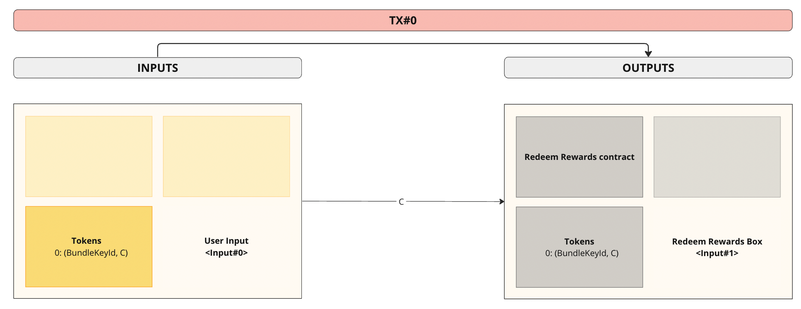
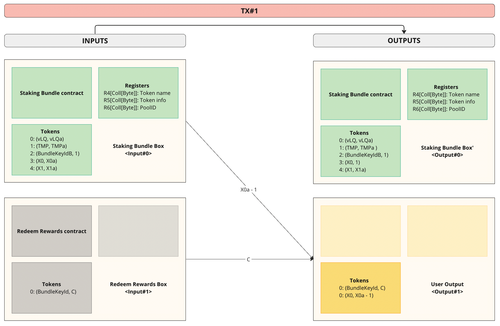
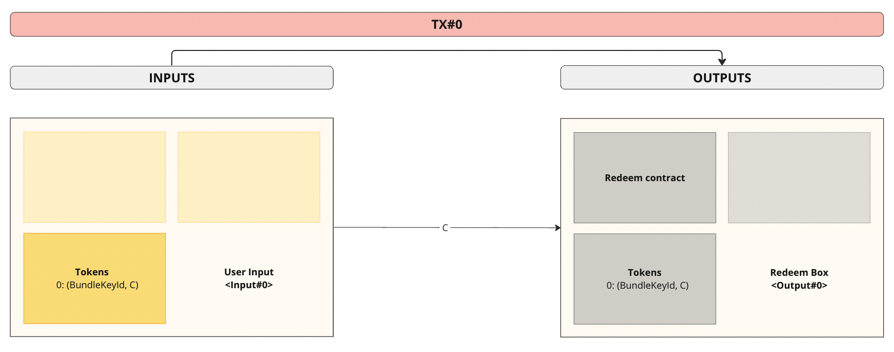

# Spectrum Finance liquidity mining protocol (with parallel rewards and APR increasing support)

Liquidity Mining Protocol allows anyone to set up his own liquidity mining (LM) program targeted at the desired pool on
Spectrum Finance.
The program can distribute **2 reward tokens** in parallel: **main** reward token and **optional** reward token.
The optional program budget can be added either at program initialization or deposited during the program.
Both the main and optional budgets can be increased during the program to increase APR.

## Liquidity Mining Pool

Liquidity Mining (LM) Pool is represented on-chain as a UTxO with the following structure:

### Datum

| Field                    | Type         | Description                                                   |
|--------------------------|--------------|---------------------------------------------------------------|
| `epochLen`               | `Integer`    | Length of one epoch in blocks                                 |
| `epochNum`               | `Integer`    | Number of epochs in LM program                                |
| `programStart`           | `Integer`    | Block the program starts at                                   |
| `redeemLimitDelta`       | `Integer`    | Number of blocks after program to redeem without restrictions |
| `mainBudget`             | `Long`       | Last updated main reward tokens amount                        |
| `optionalBudget`         | `Long`       | Last updated optional reward tokens amount                    |
| `mainBudgetRedeemer`     | `Coll[Byte]` | Address which can redeem main program budget                  |
| `optionalBudgetRedemeer` | `Coll[Byte]` | Address which can redeem optional program budget              |
| `maxRoundingError`       | `Long`       | Total allowable residual from rounding                        |
| `epoch`                  | `Int`        | Index of the last compounded epoch                            |

###   

_Notes_:

* `maxRoundingError` can be estimated as `epochNum` . Since the exact number of participants is difficult to predict in
  advance,
  it is convenient to choose a larger value, but it should be << `mainBudget / epochNum` . If the `maxRoundingError`
  value is too small, the **LM program may break**,
  and if the value is too large, the **distribution of rewards may be incorrect**!
* `optionalBudget` and `optionalBudgetRedemeer` must be initialized with at least 1 optional reward token.
* `epoch` **indexing starts from 1**, default value for programs initialization is 0.

### Tokens

| Name                  | Description                                                        |
|-----------------------|--------------------------------------------------------------------|
| Pool ID               | An NFT to identify the pool                                        |
| Main reward token     | Main budget of the LM program                                      |
| Optional reward token | Optional budget of the LM program                                  |
| LQ token              | Locked LQ tokens                                                   |
| vLQ token             | Tokens representing locked share of LQ                             |
| Temporal Token        | Left program epochs times liquidity                                |
| Bundle Key Token      | Token that is used to identify the ownership of the Staking bundle |

## Staking bundle

Staking bundle is responsible for holding vLQ, Temporal tokens (TMP) and collected Main and Optional reward tokens.
Staking bundle script guarantees bundling of tokens and controls Compounding, Redeem Rewards and Redeem operations (
see "User scenarios" below).

### Tokens

| Name           | Description                                              |
|----------------|----------------------------------------------------------|
| vLQ            | Virtual LQ token. Represents certain amount of liquidity |
| TMP            | Temporal token                                           |
| BundleKeyToken | Token to identify the ownership                          |
| X0             | Collected main reward tokens                             |
| X1             | Collected optional reward tokens                         |

## User scenarios

### Creator

#### Create Self-Hosted LM Pool

Bob works on a project X with a token Xt. He would like to incentive holders of X0 to keep their tokens in ADA/X0
pools.
To do that, Bob sets the **Datum** and sends `L0` tokens X0 (main budget) and at least 1 token X1 (optional budget)
to the LM Pool script address.
Bob should configure his own Ergo-node and off-chain bots to perform transactions.

#### General LM Pool initialization rules

When initializing an LM Pool (Self-Hosted or Delegated), the following actions **must be performed:**

1. Correct config:
    1. `epochNum` <= `maxRoundingError` << `mainBudget / epochNum` && `epochNum` <
       = `maxRoundingError` << `optionalBudget / epochNum`

2. Initial transaction with correct tokens' amounts, the creator of the LM Pool should also Deposit
   some LQ tokens and not Redeem received Staking Bundle until the LM program end.:

| Name | Amount                                              |
|------|-----------------------------------------------------|
| X0   | `mainBudget`                                        |
| LQ   | `initialDeposit`                                    |
| vLQ  | 0x7fffffffffffffffL - `initialDeposit`              |
| TMP  | 0x7fffffffffffffffL - `initialDeposit` * `epochNum` |
| X1   | `optionalBudget`                                    |

_Notes_:

* Without the `initialDeposit` the LM program will break, no one will be able to take part in it.
  Amount of the `initialDeposit` should be tiny, **it should not be
  redeemed either during or after the end of the program!**

#### Deposit main/optional program budget
During the program creator can deposit main or optional reward tokens to increase APR of the program.
Budget deposits can be executed only after all rewards are distributed for the previous epoch and will
be taken into account immediately in the current epoch rewards calculation, thus, it's recommended to
perform budget deposits in the beginning of the epoch.

#### Redeem main/optional program budget
If the program breaks down for unforeseen reasons, the creator of the program can redeem his budget programs end.
Redeem can only be done by the address from the pool's redeemers (`mainBudgetRedeemer` for the main budget redeem
and `optionalBudgetRedeemer` for the optional budget redeem).

### Participant

#### Deposit

Alice wants to participate in LM program X. To do that, she sends `LQa` ADA/Xt LQ tokens to LM script
address and receives bundled (see "Staking bundle" section above) `vLQa` vLQ tokens + `TMPa` temporal tokens in return,
where `vLQa` - amount of LQ tokens deposited, `LQa = vLQa`, `TMPa = NumEpochsDelegated * vLQa`.
She also gets a BundleKeyToken token `(BundleKeyId, C)`, which will be needed for "Staking bundle" redemption.

_Notes_:
* If the user wants to add more LQ tokens, a new "Staking bundle" will be released
* New "Staking bundle" **can't be released until all previous epochs are compounded**
* Amount of received Bundle Key Tokens C is 0x7fffffffffffffffL - 1L

#### Collecting Rewards

After each epoch rewards, allocated for each epoch, are fully distributed among Staking bundles.
Each bundle automatically receives a reward of `EpochReward * StakerLQ / LockedLQ` tokens X0 and X1 tokens for each
passed epoch.
`TMPa - vLQa * NumEpochsBurned` epoch token is withdrawn from Alice's staking bundle box each time compounding happens.

_Notes_:
* After each completed epoch, the pool budgets in the pool registers (`mainBudget` and `optionalBudget`) must
be updated in accordance with the current balances of reward tokens in the pool.
* 
### Redeem Rewards

If Alice decide to claim her rewards she can receive it from her bundle using the input with the associated
Bundle Key Tokens.

### Redeem Bundle

Once Alice decided to unstake her liquidity she returns her staking bundle to LM Pool and receives proportional amount
of LQ tokens
to the amount of vLQ returned. Redemption is only allowed after all rewards are claimed from the bundle.

_Notes_:

* LQ tokens can't be redeemed **until all previous epochs are compounded** or until `redeemLimitDelta` is reached after
  the end of the program